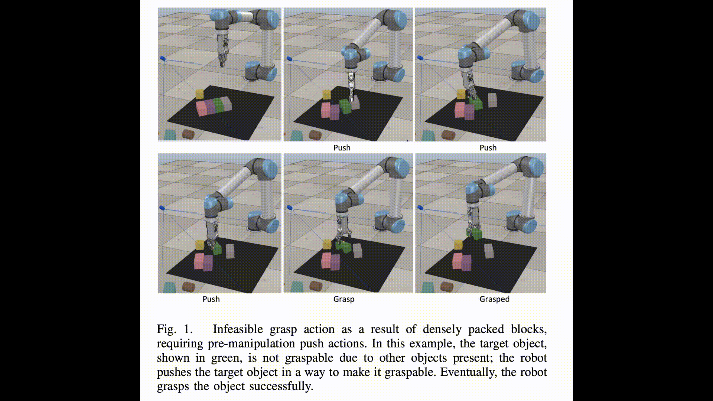

The official repository for the paper: 
# Self-Supervised Learning for Joint Pushing and Grasping Policies in Highly Cluttered Environments

Demo Video: [YouTube](https://www.youtube.com/watch?v=EUrUt9XO7sI&t=1s&ab_channel=KamalMokhtar) And [Paper](https://arxiv.org/abs/2203.02511)

Robots often face situations where grasping a goal object is desirable but not feasible due to other present objects preventing the grasp action. We present a deep  Reinforcement Learning approach to learn grasping and pushing policies for manipulating a goal object in highly cluttered environments to address this problem.
In particular, a dual reinforcement learning model approach is proposed, which presents high resilience in handling complicated scenes, reaching
$98\%$ task completion using primitive objects in a simulation
environment. To evaluate the performance of the proposed
approach, we performed two extensive sets of experiments in packed objects and a pile of objects scenarios. Experimental results
showed that the proposed method worked very well in both scenarios and outperformed the recent state-of-the-art approach.
rained models and source code for the results reproducibility purpose are publicly available.



## Gazebo
You’ll also find the attachments containing the case files for Gazebo in Gazebo_cases folder, as well as the corresponding .obj files for the objects used.

Please note: since the coordinate axes differ between CoppeliaSim and Gazebo, we’ve already swapped the x and y values accordingly in the cases and gazebo_world.txt files. So you can use them directly without additional modification.

## Scenarios showcasing clearing goal-object by pushing to be eventually grasped   

## Installation
### Method 1 (Ubuntu 18.04)
- Python 3.6
- CoppeliaSim_Edu_V4_1_0_Ubuntu18_04

```
pip install -r requirementsMethod1.txt
```

### Method 2 (Ubuntu 20.04)
- Python 3.8
- CoppeliaSim_Edu_V4_2_0_Ubuntu20_04
```
pip install -r requirementsMethod2.txt
```

### Method 3 Singularity Container
We have made a container publicly available which is useful to be used in High Performance Computing (HPC) clusters

singularity .sif image file can be downloaded from [.sif](https://drive.google.com/drive/folders/1KaAugjPULuasGZQbJVwtFDrTRwi36jLD?usp=sharing) 
It contains Ubnutu 20.04 image and all the required packages to run the model training and testing. One needs to bind the project file to be able to run the project.

## Branches
There are two branches in this repository. The main one has no mask as input to the model. The *maskInput* branch has the mask of the goal object as input to the model. 
Both trained models are available, and the rest of the procedure is the same for the two different approaches.

## Train
 We  trained  the  modelsusing  NVIDIA  V100  Graphics  Processing  Unit  for  fastertraining  time.
### Train Grasp
```
# Grasp Goal agnostic
python main.py --stage grasp_only --num_obj 5 --goal_conditioned --goal_obj_idx 4 --experience_replay --explore_rate_decay --save_visualizations
```

```
# Grasp Goal conditioned
python main.py --stage grasp_only --num_obj 5 --grasp_goal_conditioned --goal_conditioned --goal_obj_idx 4 --experience_replay --explore_rate_decay --save_visualizations --grasp_explore --load_explore_snapshot --explore_snapshot_file '.pth file from the previous training'
```
### Train Push
```
# Push training
python main.py --stage push_only --grasp_reward_threshold Qg --grasp_goal_conditioned --goal_conditioned --goal_obj_idx k --experience_replay --explore_rate_decay --save_visualizations  --load_snapshot --snapshot_file 'DIRECTORY OF YOUR PRE-TRAINDE GOAL-CONDITIONED PUSH-GRASP NET'
```
### Train Alternate
To minimize the distribution mismatch problem we alternate the training we first start with the grasp training since the push has improved in performance compared to the previous stage.
```
# Alternate to grasp training
python main.py --stage push_only --alternating_training --grasp_goal_conditioned --goal_conditioned --goal_obj_idx 4 --experience_replay --explore_rate_decay --save_visualizations  --load_snapshot --snapshot_file '.pth file from the previous training' 
```

```
# Alternate to push training
python main.py --stage push_only --grasp_reward_threshold 1.8 --grasp_goal_conditioned --goal_conditioned --goal_obj_idx 4 --experience_replay --explore_rate_decay --save_visualizations  --load_snapshot --snapshot_file '.pth file from the previous training' 
```
## Testing
pre-trained model can be downloaded from [model](https://drive.google.com/drive/folders/1KaAugjPULuasGZQbJVwtFDrTRwi36jLD?usp=sharing)

### Test 1
Compact scenario where the target object is occluded with structured clutter, The termianl output is saved to a text file so that can be later used for evaluation.
```
python main.py --stage push_grasp --num_obj 10 --experience_replay --explore_rate_decay --is_testing --test_preset_cases --test_preset_file 'simulation/test-cases/test-10-obj-06.txt' --load_snapshot --snapshot_file '.pth trained model or our trained model' --save_visualizations --grasp_goal_conditioned --goal_conditioned --goal_obj_idx 1 > test1.txt
```
### Test 2
Unstructured case of testing keep the goal object set below to 1 since the goal object has to be the green object, c is the number of objects that can be placed in the environment, max 20. Thhere are more test files in the directory with a different goal object shape that can be used. The termianl output is saved to a text file so that can be later used for evaluation.
```
python main.py --stage push_grasp --num_obj c --experience_replay --explore_rate_decay --is_testing --test_preset_cases --test_preset_file 'simulation/test-cases/Test0.txt' --load_snapshot --snapshot_file '.pth trained model or our trained model' --save_visualizations --grasp_goal_conditioned --goal_conditioned --goal_obj_idx 1 > test2.txt
```
## Evaluation
First modify the directory to the teminal output text file (i.e., test1.txt), then run the below script.
```
python evaluate.py
```
## Acknowledgment

We made use of the code made by https://github.com/xukechun/Efficient_goal-oriented_push-grasping_synergy 
Plese download household objects from: https://github.com/c-yiting/pybullet-URDF-models

We  thank  the  Center  for  Information  Technology  of  the University of Groningen for their support and for providing access to the Peregrine high performance computing cluster.
